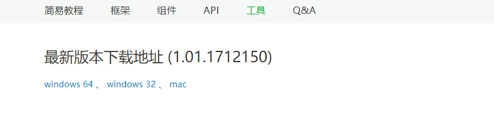
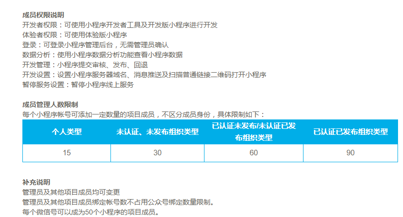
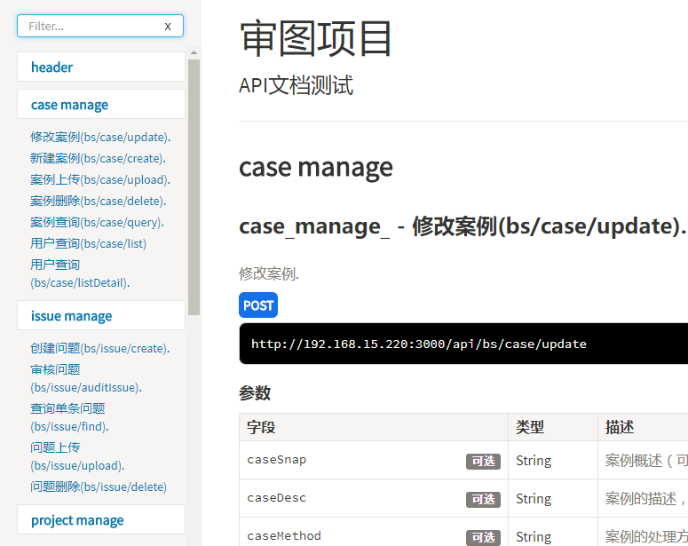

# MapCensorWeixin *审图微信小程序版*

## 构建微信小程序步骤
* 下载[微信开发者工具](https://mp.weixin.qq.com/debug/wxadoc/dev/devtools/download.html);

    
* 由于这个项目是我用自己的微信号创建的，需要开发的话，好像必须我把其他人加为项目开发者才可以开发，所以得向我申请;

    
* 项目后台接口为审图的开发环境接口，具体的接口文档为：[http://192.168.4.189:3000/apiDoc/]()

    